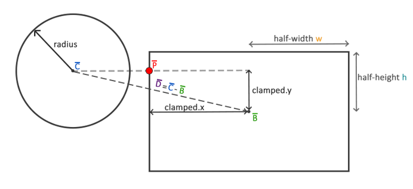

### RacunalnaGrafika-Vjezba3
## O vježbi i načinu pokretanja
Treća laboratorijska vježba iz kolegija računalne grafike na Fakultetu Elektrotehnike i računarstva, Zagreb.
U sklopu vježbe ostvarena je jednostavna 2D arkadna igra koristeći OpenGL, C++ i razvojnu okolinu Visual studio.

Program je razvijen za x64 Windows platformu. Zbog toga prilikom gradnje projekta i pokretanja potrebno je u VS ili nekom drugom IDE-u potrebno odabrati x64 platformu.

Za ostvarivanje rješenja bile su potrebne sljedeće bibiloteke:
                     64-bitna verija glfw biblioteke (https://github.com/glfw/glfw),
                     glad biblioteka (generirana sljedećim linkom sa zeljenim parametrima (core, C/C++, OpenGL 3.3): https://glad.dav1d.de/), glm biblioteka (https://glm.g-truc.net/0.9.9/index.html) te SOIL biblioteka za učitavanje slika (https://github.com/littlstar/soil).
                    
Prevođenje programa (pomoću VS2017) zahtjeva dohvaćanje potrebnih (navedenih) biblioteka i povezivanje istih s projektom  u koji su importani izvorni kodovi i resursi (shaders, maps, textures). Nakon toga potrebno je kopirati glad.c datoteku u direktorij projekta i importati istu u projekt. Osim toga zahtjeva se da se program izgradi za x64 platformu.

Prikaz igre koja je ostvarena je prikazan na sljedećoj slici:

## Objašnjenje igre i mapa
Cilj igre je jednostavo razbiti sve blokove koji se nalaze na mapi kako bi se prešlo na iduću mapu. Palica kojom upravlja igrač se kreće tipkama lijevo i desno a ispucavanje loptice se postiže tipkom space. Za izlazak iz programa koristi se tipka escape.

Mape su definirane na način da se u tekstualnu datoteku zapišu brojevi koji će predstavljati izgled mape. I to na sljedeći način:
1. 0 - praznina
2. 1 - čvrsti blok
3. 2 - plavi
4. 3 - zeleni
5. 4 - smeđi
6. 5 - narančasti
7. 6 - bijeli
8. 7 - crveni
9. ostali - crni

Takav layout mape za konkretno gore prikazanu mapu je prikazan na sljedećoj slici čiji je sadržaj spremljen u datoteci s ekstenzijom .mp:

## AABB - AABB kolizija
Sljedeće je zanimljivo pogledati kako je rješenja kolizija između loptice i blokova te igrače palice. Prvi ostvareni način je bio koristiti AABB - AABB koliziju (AABB - axis aligned bounding box) gdje se prvo oko objekta opisuje pravokutnik koji je poravnat s osima scene. Nakon toga se gleda dolazi li do preklapanja tih pravokutnika u sustavu scene. Tako je za pravokutne objekte to prirodni oblik opisa objekta dok za krug koji predstavlja loptu to nije. Ideja ovakvog rješavanja kolizije je prikazana sljedećom slikom:

## Krug - AABB kolizija
Pošto ovakav način opisa objekta lopte nije prirodan za njezin oblik može doći do neželjenog ponašanja (loptica se odbije prije nego što zapravo dodirne blok). Zbog toga je potrebno definirati drugi način rješavanja takve kolizije. Za to koristimo Kugla - AABB koliziju. U ovoj koliziji se radi o tome da je kugla odnosno krug lopte opisan kružnicom a ne pravokutnikom kao u prošlom primjeru. Sada se radi o tome da je potrebno naći najbližu točku lopti na pravokutniku koji opisuje blok. Ideja je ilustrirana na sljedećoj slici:

Problem nastaje kako naći najbližu točku krugu lopte (na slici točka P). Na slici vektor D određuje udaljenost centra lopte od centra objekta. Taj problem se rješava metodom koja se naziva *clamping*. Bez ulaženja u detalje ta ideja se može pokazati na primjeru jedne koordinate prema slici iznad:

       clampedX = min(-w, max(Dx, w)) , uz w pola širine bloka i Dx x koordinatu vektora D
       Px = Bx + clampedX , uz Px x koordinatu točke P, a Bx x koordinatu točke središta pravokutnika
       
Nakon toga imamo točku P koja je točka koja je najbliža objektu lopte. Iz toga računamo udaljenost središta kugle C do točke P i ako je ona manja od radijusa došlo je do kolizije.

## Razrješavanje kolizije
# Lopta - Blok
Rješavanje kolizije kod sudara lopte i bloka potrebno je zaključiti iz kojeg smjera je lopta udarila u blok. Za to su definirani pomoćni vektori smjera:

      Gore (0,1)
      Dolje (0, -1)
      Desno(1, 0)
      Lijevo (-1, 0)

Pomoću kuteva koji se dobe iz skalarnog produkta vektora smjera lopte i svakih od tih vektora treba pronaći najmanji i upravo je to vektor smjera s kojim smjer lopte zatvara najmanji kut. To znači da je iz tog smjera lopta udarila u blok. Po tome zaključujemo je li došlo do vertikalnog ili horizontalnog sudara i obrćemo potrebnu komponentu brzine: x za horizontalni, y za vertikalni. Osim toga na temelju udaljenosti točke P od središta lopte dolazi se do iznosa za koliko je lopta "ušla u blok". Stoga je potrebno loptu vratiti "nazad" za taj iznos kako bi odbijanje lopte od bloka bilo što prirodnije.
